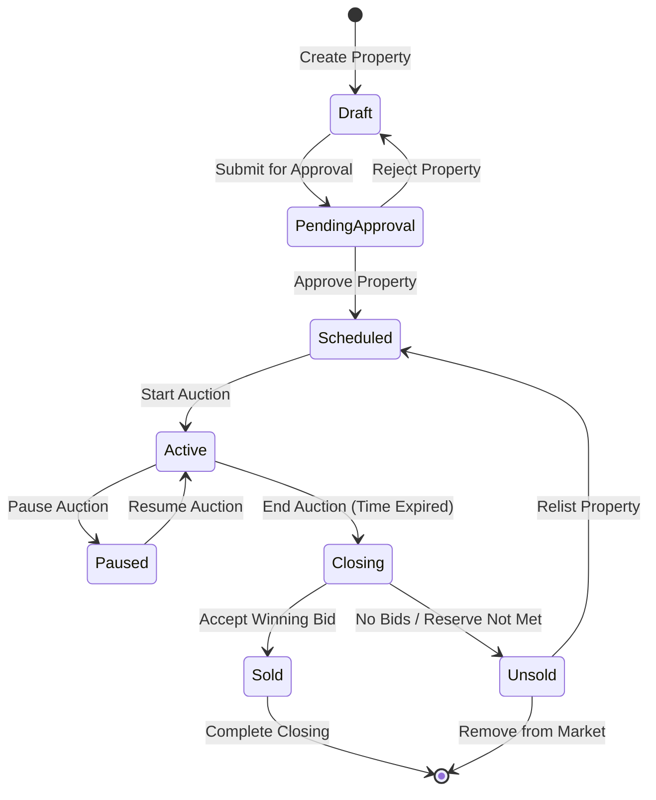

# BeeAI Workflow Examples for RealtyIQ

This document provides detailed examples of high-value workflows that can be implemented using the BeeAI Framework for the GSA Real Estate Sales (GRES) application.

## Table of Contents

1. [Bidder Onboarding & Verification Workflow](#1-bidder-onboarding--verification-workflow) ✅ IMPLEMENTED
2. [Property Due Diligence Workflow](#2-property-due-diligence-workflow)
3. [Property Valuation & Market Analysis Workflow](#3-property-valuation--market-analysis-workflow)
4. [Conversational Research Assistant Workflow](#4-conversational-research-assistant-workflow)
5. [Auction Lifecycle State Machine Workflow](#5-auction-lifecycle-state-machine-workflow)
6. [Compliance Audit Trail Workflow](#6-compliance-audit-trail-workflow)
7. [Document Intelligence Extraction Workflow](#7-document-intelligence-extraction-workflow)

---

## 1. Bidder Onboarding & Verification Workflow

**Status**: ✅ IMPLEMENTED  
**File**: `bidder_onboarding_workflow.py`  
**Priority**: HIGHEST VALUE

### Overview
Automates the complete bidder registration and verification process, orchestrating compliance checks across multiple agents and applying business rules for approval/denial.

### Business Value
- **Time Savings**: Reduces registration processing from hours to seconds
- **Compliance**: Ensures 100% screening against SAM.gov and OFAC lists
- **Consistency**: Standardizes approval logic across all registrations
- **Audit Trail**: Complete documentation of all compliance checks

### Current Process (Manual)
1. User submits registration form
2. Admin manually checks SAM.gov exclusions
3. Admin manually checks OFAC SDN list
4. Admin reviews property auto-approval settings
5. Admin manually approves/denies registration
6. Admin sends notification to bidder

**Problems**: Time-consuming, prone to errors, inconsistent application of rules

### Automated Workflow
```mermaid
graph TB
    start[Start: Bidder Registration] --> validate[Validate Registration Data]
    validate --> checkSam[Check SAM.gov Exclusions]
    checkSam --> checkOfac[Check OFAC SDN List]
    checkOfac --> combine[Combine Compliance Results]
    combine --> eligible{Pass All Checks?}
    eligible -->|FAIL| deny[DENIED - Notify Bidder]
    eligible -->|FLAGGED| manualReview[Manual Review Required]
    eligible -->|PASS| autoApproval{Auto-Approval Enabled?}
    autoApproval -->|YES| setBidLimit[Set Bid Limit]
    autoApproval -->|NO| pendingApproval[Pending Manual Approval]
    setBidLimit --> approved[APPROVED - Create Registration]
    approved --> notify[Send Approval Notification]
    deny --> auditLog[Log to Audit Trail]
    manualReview --> auditLog
    notify --> auditLog
    pendingApproval --> auditLog
    auditLog --> end[End]
```

### Agents Orchestrated
- **Bidder Verification Agent**: Orchestrate compliance checks
- **SAM Agent**: Check federal exclusions (138,885+ records)
- **OFAC Agent**: Screen against SDN list (18,708+ records)
- **GRES Agent**: Check auto-approval settings, validate property
- **IDV Agent**: Create identity verification record (optional)

### State Model
```python
class BidderOnboardingState(BaseModel):
    # Input
    bidder_name: str
    property_id: int
    registration_data: dict
    
    # Intermediate results
    property_settings: dict | None = None
    sam_check_result: dict | None = None
    ofac_check_result: dict | None = None
    
    # Compliance determination
    is_eligible: bool = False
    requires_manual_review: bool = False
    risk_factors: list[str] = []
    
    # Approval logic
    auto_approval_enabled: bool = False
    approval_status: str = "pending"  # pending, approved, denied, review_required
    bid_limit: float | None = None
    
    # Audit trail
    checks_performed: list[dict] = []
    timestamp: str = ""
```

### Business Rules
1. **DENIED if**:
   - Found on SAM.gov exclusions list (active exclusion)
   - Match on OFAC SDN list (>85% similarity in strict mode, >60% default)
   - Property is not active or approved

2. **MANUAL REVIEW if**:
   - Potential OFAC match (60-85% similarity)
   - Recently terminated SAM exclusion
   - Risk factors identified

3. **AUTO-APPROVED if**:
   - Passes both SAM and OFAC checks
   - Property has auto-approval enabled
   - Within bid limit parameters

4. **PENDING APPROVAL if**:
   - Passes compliance checks
   - Auto-approval not enabled

### Usage Example
```python
from workflows.bidder_onboarding_workflow import BidderOnboardingWorkflow

workflow = BidderOnboardingWorkflow()

result = await workflow.run(
    bidder_name="John Smith",
    property_id=12345,
    registration_data={
        "email": "john.smith@example.com",
        "phone": "555-123-4567",
        "user_type": "Investor",
        "address": "123 Main St, City, ST 12345",
        "terms_accepted": True,
        "age_accepted": True
    }
)

# Check results
if result.state.is_eligible and result.state.approval_status == "approved":
    print("Bidder approved and ready to bid!")
elif result.state.requires_manual_review:
    print("Flagged for manual review")
else:
    print("Registration denied")
```

### Implementation Highlights
- Defensive programming with validation at each step
- Comprehensive error handling
- Event emission for observability
- Integration with existing Django models
- Full audit trail of all decisions

---

## 2. Property Due Diligence Workflow

**Status**: PLANNED  
**Priority**: HIGH VALUE

### Overview
Automates comprehensive property research by orchestrating multiple agents to gather and synthesize information from various sources.

### Business Value
- **Faster Closings**: Accelerate due diligence from days to hours
- **Comprehensive Analysis**: Never miss critical information
- **Cost Savings**: Reduce manual research time by 80%
- **Better Decisions**: Synthesized insights from all available data

### Workflow Diagram
```mermaid
graph TB
    start[Start: Property ID] --> getBasic[Get Property Details]
    getBasic --> parallel{Parallel Research}
    
    parallel --> comparable[Find Comparable Sales]
    parallel --> documents[Search Related Documents]
    parallel --> compliance[Check Title/Liens]
    parallel --> historical[Get Auction History]
    
    comparable --> synthesis[Synthesize Findings]
    documents --> synthesis
    compliance --> synthesis
    historical --> synthesis
    
    synthesis --> assessment{Risk Assessment}
    assessment -->|HIGH RISK| flag[Flag for Review]
    assessment -->|MEDIUM RISK| caution[Proceed with Caution]
    assessment -->|LOW RISK| proceed[Ready for Auction]
    
    flag --> report[Generate Due Diligence Report]
    caution --> report
    proceed --> report
    report --> end[End]
```

### Agents Orchestrated
- **GRES Agent**: Property details, comparable sales, site information, auction history
- **Library Agent**: Search for appraisals, environmental reports, title documents
- **SAM Agent**: Check if seller/broker/agent is excluded
- **Synthesis LLM**: Combine all findings into comprehensive report

### State Model
```python
class PropertyDueDiligenceState(BaseModel):
    property_id: int
    property_details: dict | None = None
    comparable_sales: list[dict] = []
    documents_found: list[dict] = []
    compliance_checks: dict | None = None
    auction_history: list[dict] = []
    risk_factors: list[str] = []
    risk_level: str = "unknown"  # low, medium, high
    findings_summary: str = ""
    recommendations: list[str] = []
```

### Key Steps
1. Get property details (location, size, condition, zoning)
2. Find comparable sales (3-5 similar properties)
3. Search for documents (appraisals, assessments, environmental reports, surveys)
4. Check seller/broker compliance (SAM.gov)
5. Review auction history (previous listings, bids, outcomes)
6. Assess risks (title issues, environmental concerns, condition)
7. Synthesize findings into comprehensive report
8. Generate recommendations (pricing, marketing, disclosures)

---

## 3. Property Valuation & Market Analysis Workflow

**Status**: PLANNED  
**Priority**: HIGH VALUE

### Overview
Performs comprehensive property valuation using multiple data sources and analysis methods, executed in parallel for speed.

### Business Value
- **Accurate Pricing**: Data-driven reserve price recommendations
- **Market Intelligence**: Real-time market condition analysis
- **Faster Processing**: Parallel analysis reduces time by 70%
- **Better ROI**: Optimal pricing increases final sale amounts

### Workflow Diagram
```mermaid
graph TB
    start[Start: Property ID] --> getProperty[Get Property Details]
    getProperty --> parallel{Parallel Analysis}
    
    parallel --> comparable[Comparable Sales Analysis]
    parallel --> bidHistory[Historical Bid Analysis]
    parallel --> documents[Document Value Analysis]
    parallel --> market[Market Trends Analysis]
    
    comparable --> synthesis[Synthesize Valuation]
    bidHistory --> synthesis
    documents --> synthesis
    market --> synthesis
    
    synthesis --> calculate[Calculate Value Range]
    calculate --> recommend[Generate Reserve Price Recommendation]
    recommend --> confidence{Confidence Level?}
    
    confidence -->|HIGH| approved[Approve Recommendation]
    confidence -->|MEDIUM| review[Suggest Manual Review]
    confidence -->|LOW| manual[Require Manual Appraisal]
    
    approved --> report[Generate Valuation Report]
    review --> report
    manual --> report
    report --> end[End]
```

### Agents Orchestrated
- **GRES Agent (Comparable Sales)**: Find similar properties, recent sales
- **GRES Agent (Bid History)**: Analyze historical bidding patterns
- **Library Agent**: Extract values from appraisals and assessments
- **GRES Agent (Market Analysis)**: Current market conditions, trends
- **Synthesis LLM**: Combine insights into valuation recommendation

### State Model
```python
class PropertyValuationState(BaseModel):
    property_id: int
    property_details: dict | None = None
    comparable_sales: list[dict] = []
    avg_comparable_price: float | None = None
    bid_history_analysis: dict | None = None
    document_values: list[dict] = []
    market_trends: dict | None = None
    value_range_low: float | None = None
    value_range_high: float | None = None
    recommended_reserve: float | None = None
    confidence_level: str = "unknown"  # high, medium, low
    reasoning: str = ""
```

### Parallel Processing Example
```python
async def parallel_analysis(state: PropertyValuationState):
    # Execute all analyses simultaneously
    results = await asyncio.gather(
        analyze_comparable_sales(state),
        analyze_bid_history(state),
        analyze_documents(state),
        analyze_market_trends(state)
    )
    
    # Combine results
    state.comparable_sales = results[0]
    state.bid_history_analysis = results[1]
    state.document_values = results[2]
    state.market_trends = results[3]
    
    return "synthesize_valuation"
```

---

## 4. Conversational Research Assistant Workflow

**Status**: PLANNED  
**Priority**: MEDIUM-HIGH VALUE

### Overview
Enables multi-turn conversations with context retention, allowing users to explore properties and auctions naturally without repeating information.

### Business Value
- **Better UX**: Natural conversation flow
- **Efficiency**: Context eliminates repeated queries
- **Deeper Insights**: Follow-up questions enable thorough research
- **Learning Curve**: Easier for new users

### Workflow Diagram
```mermaid
graph TB
    start[Start: User Query] --> loadMemory[Load Conversation Memory]
    loadMemory --> analyze[Analyze Query + Context]
    analyze --> determine{Determine Action}
    
    determine -->|NEW TOPIC| research[Research New Topic]
    determine -->|FOLLOW UP| contextual[Contextual Follow-up]
    determine -->|CLARIFY| clarification[Ask Clarification]
    
    research --> execute[Execute Agent Tools]
    contextual --> execute
    clarification --> respond[Generate Response]
    
    execute --> respond
    respond --> updateMemory[Update Memory]
    updateMemory --> end{Continue Conversation?}
    end -->|YES| start
    end -->|NO| finish[End]
```

### Memory Integration
```python
from beeai_framework.memory import UnconstrainedMemory

class ConversationalResearchState(BaseModel):
    memory: InstanceOf[UnconstrainedMemory]
    current_property_id: int | None = None
    current_context: dict = {}
    user_intent: str = ""
    response: str = ""
```

### Example Conversation
```
User: "Tell me about property 12345"
Assistant: [Loads property details, stores in context]
          "Property 12345 is a 3-bedroom house in Arlington, VA..."

User: "What's the auction history?"
Assistant: [Uses stored property_id from context]
          "This property was previously listed in March 2023..."

User: "Are there any compliance issues?"
Assistant: [Runs SAM/OFAC checks on property owner/broker]
          "No compliance issues found..."

User: "Show me similar properties"
Assistant: [Uses stored property characteristics]
          "Here are 5 properties similar to 12345..."
```

### Implementation Pattern
```python
async def process_query(state: ConversationalResearchState):
    # Get last message
    last_message = state.memory.messages[-1]
    
    # Analyze with context
    if state.current_property_id:
        # Use existing context
        response = await handle_contextual_query(
            last_message.text,
            state.current_property_id
        )
    else:
        # New topic
        response = await handle_new_query(last_message.text)
    
    # Update memory
    await state.memory.add(AssistantMessage(content=response))
    
    return Workflow.END
```

---

## 5. Auction Lifecycle State Machine Workflow

**Status**: PLANNED  
**Priority**: MEDIUM VALUE

### Overview
Manages the complete auction lifecycle as a state machine with controlled transitions and validation at each stage.

### Business Value
- **Process Control**: Enforces valid state transitions
- **Automation**: Reduces manual auction management
- **Compliance**: Ensures all steps are completed
- **Notifications**: Automatic stakeholder notifications

### State Machine Diagram


### State Model
```python
class AuctionLifecycleState(BaseModel):
    property_id: int
    auction_id: int | None = None
    status: Literal[
        "draft", "pending_approval", "scheduled", 
        "active", "paused", "closing", 
        "sold", "unsold"
    ]
    auction_details: dict | None = None
    bids: list[dict] = []
    current_high_bid: float | None = None
    winner_id: int | None = None
    transition_history: list[dict] = []
```

### Transition Validation
```python
async def validate_transition(state, from_status, to_status):
    """Validate state transition is allowed"""
    valid_transitions = {
        "draft": ["pending_approval"],
        "pending_approval": ["draft", "scheduled"],
        "scheduled": ["active"],
        "active": ["paused", "closing"],
        "paused": ["active"],
        "closing": ["sold", "unsold"],
        "unsold": ["scheduled"],
    }
    
    if to_status not in valid_transitions.get(from_status, []):
        raise ValueError(f"Invalid transition: {from_status} -> {to_status}")
```

---

## 6. Compliance Audit Trail Workflow

**Status**: PLANNED  
**Priority**: MEDIUM VALUE

### Overview
Generates comprehensive compliance audit reports by screening all participants (bidders, sellers, agents) against SAM.gov and OFAC lists.

### Business Value
- **Regulatory Compliance**: Meet federal requirements
- **Risk Mitigation**: Identify compliance issues proactively
- **Audit Readiness**: Complete documentation for auditors
- **Transparency**: Clear records of all screening activities

### Workflow Diagram
```mermaid
graph TB
    start[Start: Audit Request] --> scope{Audit Scope}
    
    scope -->|PROPERTY| getProperty[Get Property Participants]
    scope -->|AUCTION| getAuction[Get Auction Participants]
    scope -->|ENTITY| getSingle[Get Single Entity]
    
    getProperty --> identifyAll[Identify All Entities]
    getAuction --> identifyAll
    getSingle --> identifyAll
    
    identifyAll --> screenBidders[Screen All Bidders]
    screenBidders --> screenSellers[Screen Sellers/Agents]
    screenSellers --> screenBrokers[Screen Brokers]
    screenBrokers --> crossRef[Cross-Reference Results]
    
    crossRef --> flagged{Any Issues Found?}
    flagged -->|YES| detailedReview[Generate Review Queue]
    flagged -->|NO| clearReport[Generate Clean Report]
    
    detailedReview --> auditLog[Create Comprehensive Audit Log]
    clearReport --> auditLog
    auditLog --> export[Export Report]
    export --> end[End]
```

### Report Structure
```python
class ComplianceAuditState(BaseModel):
    audit_id: str
    scope: Literal["property", "auction", "entity", "site"]
    entities_screened: list[dict] = []
    sam_results: list[dict] = []
    ofac_results: list[dict] = []
    issues_found: list[dict] = []
    recommendations: list[str] = []
    report_generated: str = ""
    timestamp: str = ""
```

---

## 7. Document Intelligence Extraction Workflow

**Status**: PLANNED  
**Priority**: MEDIUM-HIGH VALUE

### Overview
Automatically processes uploaded documents (PDFs) to extract structured data, classify document types, and link to relevant properties.

### Business Value
- **Time Savings**: Eliminate manual document review
- **Data Extraction**: Automatically extract key values
- **Better Search**: Enhanced metadata for document discovery
- **Quality Control**: Identify incomplete/problematic documents

### Workflow Diagram
```mermaid
graph TB
    start[Start: Document Upload] --> extract[Extract Text from PDF]
    extract --> classify[Classify Document Type]
    classify --> type{Document Type}
    
    type -->|APPRAISAL| extractAppraisal[Extract Appraisal Data]
    type -->|ASSESSMENT| extractAssessment[Extract Assessment Data]
    type -->|ENVIRONMENTAL| extractEnvironmental[Extract Environmental Data]
    type -->|TITLE| extractTitle[Extract Title Data]
    type -->|OTHER| extractGeneric[Extract Generic Metadata]
    
    extractAppraisal --> validate[Validate Extracted Data]
    extractAssessment --> validate
    extractEnvironmental --> validate
    extractTitle --> validate
    extractGeneric --> validate
    
    validate --> quality{Data Quality OK?}
    quality -->|FAIL| flagReview[Flag for Manual Review]
    quality -->|PASS| index[Add to FAISS Index]
    
    index --> link[Link to Related Properties]
    link --> notify[Notify Relevant Users]
    flagReview --> end[End]
    notify --> end
```

### State Model
```python
class DocumentIntelligenceState(BaseModel):
    document_path: str
    document_type: str | None = None
    extracted_text: str = ""
    extracted_data: dict = {}
    confidence_score: float = 0.0
    validation_issues: list[str] = []
    linked_properties: list[int] = []
    indexed: bool = False
```

### Document Types & Extraction
- **Appraisals**: Property value, date, appraiser, methodology
- **Assessments**: Tax assessment value, assessment date, lot/parcel
- **Environmental Reports**: Hazards identified, remediation required, clearance status
- **Title Documents**: Owner information, liens, easements, encumbrances
- **Surveys**: Boundary description, square footage, improvements

---

## Implementation Roadmap

### Phase 1 - Core Automation (Q1)
1. ✅ Bidder Onboarding Workflow (IMPLEMENTED)
2. Property Due Diligence Workflow
3. Property Valuation Workflow

### Phase 2 - Enhanced UX (Q2)
4. Conversational Research Assistant
5. Auction Lifecycle State Machine

### Phase 3 - Advanced Features (Q3)
6. Compliance Audit Trail Workflow
7. Document Intelligence Extraction

---

## Testing Strategy

### Unit Tests
Test individual workflow steps:
```python
async def test_sam_check_step():
    state = BidderOnboardingState(
        bidder_name="Test User",
        property_id=1
    )
    result = await check_sam_compliance(state)
    assert state.sam_check_result is not None
```

### Integration Tests
Test complete workflows:
```python
async def test_bidder_onboarding_workflow():
    workflow = BidderOnboardingWorkflow()
    result = await workflow.run(
        bidder_name="John Smith",
        property_id=12345
    )
    assert result.state.approval_status in ["approved", "denied", "review_required"]
```

### Performance Tests
Measure workflow execution time and resource usage.

---

## Additional Resources

- **BeeAI Workflows Documentation**: https://framework.beeai.dev/modules/workflows
- **BeeAI Python Examples**: https://github.com/i-am-bee/beeai-framework/tree/main/python/examples/workflows
- **Agent Documentation**: `/agents/*/SKILLS.md`
- **Tool Documentation**: `/tools/*.py`

---

**These workflows represent significant automation opportunities for the GRES application, with estimated time savings of 60-80% for manual processes.** 🚀
