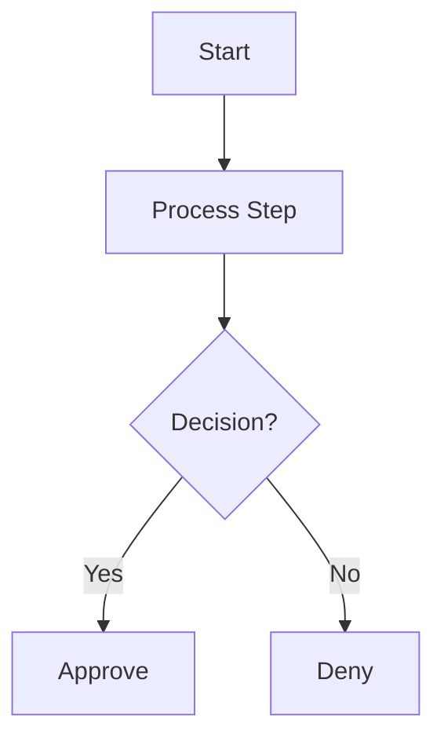
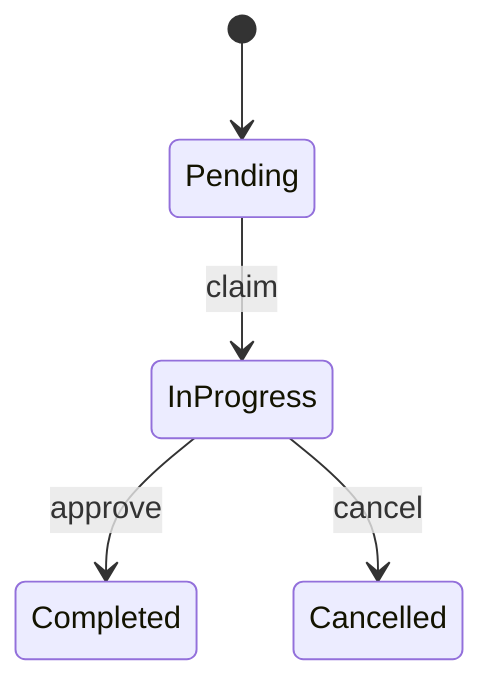
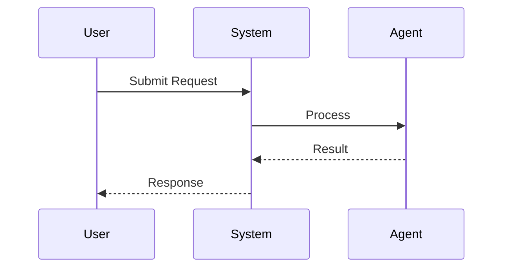

# Workflow Development Guide

**Complete guide for creating and maintaining BeeAI workflows in RealtyIQ**

---

## How to Start a New Workflow

**Preferred: Workflow Studio (AI-generated)**

1. Log in as an **admin** user.
2. Open **Workflows** in the app navigation, then click **Workflow Studio** (or go to `/workflows/studio/`).
3. Fill in the form: workflow name, ID, icon, category, **LLM for generation**, description, and a **step-by-step prompt** (use snake_case step names so they become BPMN tasks and Python methods).
4. Click **Create Workflow**. The system generates:
   - `workflow.py` (BeeAI implementation)
   - `README.md`
   - `metadata.yaml`
   - `currentVersion/workflow.bpmn` (BPMN 2.0)
   - `currentVersion/bpmn-bindings.yaml`
5. The new workflow appears in the workflow list and can be run or edited (e.g. BPMN editor, bindings) from the workflow detail page.

See [WORKFLOW_STUDIO_IMPLEMENTATION.md](../../docs/developer-guide/implementation/WORKFLOW_STUDIO_IMPLEMENTATION.md) for more detail.

**Alternative: Create manually**

Use this when you need full control or want to start from templates instead of AI generation.

---

## Quick Start (Manual)

### Create a New Workflow (Manual)

1. Copy templates:
   ```bash
   cp templates/USER_STORY_TEMPLATE.md my_workflow/USER_STORY.md
   cp templates/WORKFLOW_DOCUMENTATION_TEMPLATE.md my_workflow/documentation.md
   ```

2. Create workflow structure:
   ```
   workflows/my_workflow/
   ├── USER_STORY.md           # Start here: Define business value
   ├── workflow.py             # Implementation
   ├── metadata.yaml           # Configuration
   ├── currentVersion/
   │   ├── workflow.bpmn       # BPMN 2.0 diagram (primary; used by UI)
   │   └── bpmn-bindings.yaml # BPMN element → handler bindings
   ├── documentation.md        # Technical docs
   └── README.md               # Quick reference
   ```
   The registry loads BPMN from `currentVersion/` first, then `v1/`, `v2/`, etc., or the workflow root. Prefer **BPMN 2.0** (`workflow.bpmn`); Mermaid (`diagram.mmd`) is optional and only used when no BPMN is present.

3. Implement using BeeAI Framework patterns (see examples in `EXAMPLES.md`)

---

## User Story Driven Development

### Why User Stories?

User stories ensure workflows deliver real business value by:
- Focusing on user needs, not just technical capabilities
- Defining measurable success criteria
- Documenting business rules and edge cases
- Providing context for future maintenance

### User Story Template

See `../templates/USER_STORY_TEMPLATE.md` for the complete template.

**Structure:**
```markdown
# [Workflow Name] - User Story

## User Story
As a [role], I want to [action], so that [benefit].

## Business Value
- [Quantifiable benefit 1]
- [Quantifiable benefit 2]

## Acceptance Criteria
Given [context]
When [action]
Then [expected outcome]

## Current Process vs Workflow
[Before/After comparison]

## Success Metrics
[Measurable KPIs]
```

### Development Process

1. **Start with User Story** - Define the "why" before the "how"
2. **Document Current Process** - Understand pain points
3. **Design Workflow Steps** - Map out automation logic
4. **Create BPMN Diagram** - Add `workflow.bpmn` (BPMN 2.0); optional `bpmn-bindings.yaml` for handler bindings
5. **Implement & Test** - Build with BeeAI Framework
6. **Validate Against Criteria** - Ensure all acceptance criteria met

---

## Workflow Documentation

### Documentation Structure

Each workflow should have 3 documentation files:

1. **`USER_STORY.md`** - Business context and value
2. **`documentation.md`** - Complete technical documentation
3. **`README.md`** - Quick reference for users

### Documentation Template

See `../templates/WORKFLOW_DOCUMENTATION_TEMPLATE.md` for the complete template.

**Sections:**
- Overview & Purpose
- Business Value
- Process Flow & Diagram
- Input/Output Specifications
- State Management
- Error Handling
- Testing & Validation
- Examples & Usage

---

## BPMN Diagrams and Versions

### workflow.bpmn and bpmn-bindings.yaml

- **`workflow.bpmn`** – BPMN 2.0 XML is the primary diagram format. The UI uses it for the workflow detail and run-detail views (bpmn-js). Place it in the workflow root or in a version subfolder (e.g. `currentVersion/workflow.bpmn` or `v1/workflow.bpmn`).
- **`bpmn-bindings.yaml`** – Optional file that maps BPMN element IDs to handlers/tasks. Used by the BPMN runner and by the workflow editor. Can live next to `workflow.bpmn` in the same version folder.

### Version subfolders

Use `currentVersion/` (preferred) or `v1/`, `v2/`, etc. under a workflow to keep BPMN assets. The workflow registry resolves the current version (preferring `currentVersion/`, then highest-numbered `vN/`) and loads `workflow.bpmn` (and `bpmn-bindings.yaml`) from that folder when present; otherwise it falls back to the workflow root. The version manager can copy and compare these files across versions.

### BPMN-ready workflow contract

Execution is **BPMN-only**: a workflow is runnable only when it satisfies the engine contract below.

**Required files**

- `workflow.py` – Python implementation
- `metadata.yaml` – Workflow configuration and input/output metadata
- `currentVersion/workflow.bpmn` – BPMN 2.0 XML (or equivalent resolved version folder such as `v1/`)
- `currentVersion/bpmn-bindings.yaml` – BPMN task id → handler bindings

The registry and runner resolve the active version folder (`currentVersion/` first, then highest `vN/`) and load both the BPMN XML and bindings from there.

**Required Python contract**

`workflow.py` must provide:

- a workflow executor class whose name ends with `Workflow`
- a state class whose name ends with `State`
- async handler methods referenced by `bpmn-bindings.yaml`

Expected handler signature:

```python
async def validate_input(self, state: MyWorkflowState) -> str | None:
    ...
```

Handler rules:

- handlers must be instance methods on the executor class
- handlers must accept `state` as the primary input
- handlers may return `None` or other values for logging; **routing follows the BPMN diagram** (sequence flow, exclusive gateway conditions, parallel fork/join, etc.)—do not rely on return values to pick the next task
- helper methods are fine, but only bound handlers are invoked by the BPMN engine

**Required state contract**

The BPMN engine creates the initial workflow state by instantiating the state class from workflow inputs. That means:

- constructor fields must align with actual submitted inputs
- constructor fields should align with `metadata.yaml` `input_schema`
- the state must be serializable enough for pause/resume persistence

The engine expects `workflow_steps` to exist or be safely creatable on the state object. Recommended pattern:

```python
from pydantic import BaseModel, Field


class MyWorkflowState(BaseModel):
    property_id: int
    user_id: int
    workflow_steps: list[str] = Field(default_factory=list)
```

**Required BPMN contract**

The BPMN diagram must include:

- one start event
- at least one executable task
- valid sequence flow connections
- task ids that match entries in `bpmn-bindings.yaml`

The runtime supports a **documented subset** of BPMN 2.0: single-path flows, **exclusive** and **parallel** gateways (with save-time topology checks), **interrupting** boundary timer/error on tasks, **intermediate** timer/message catch (with resume semantics), **embedded subprocess** (single level, no nesting), task retries, and workflow-level cancel/timeout. Unsupported shapes are rejected at save or fail at runtime with a clear error—see [BPMN_ENGINE_REVIEW.md](../../docs/architecture/BPMN_ENGINE_REVIEW.md) (top sections and §2).

**Required bindings contract**

`bpmn-bindings.yaml` must provide:

- `workflow_id`
- `executor`
- `serviceTasks`

Each executable BPMN service task must have a binding entry, for example:

```yaml
workflow_id: my_workflow
executor: workflows.my_workflow.workflow.MyWorkflowWorkflow

serviceTasks:
  validate_input:
    handler: validate_input
    description: Validate inputs before processing
```

Binding rules:

- each BPMN service task id must exist in `workflow.bpmn`
- each bound handler must exist on the executor class
- bindings should live beside the active `workflow.bpmn` file in the same version folder

**Input and metadata contract**

`metadata.yaml` should describe the workflow accurately enough that:

- users know what inputs to provide
- the UI can render the workflow form correctly
- the state class can be instantiated without guessing

Minimum required metadata fields remain:

- `id`
- `name`
- `description`

Recommended additional fields:

- `input_schema`
- `outputs`
- `estimated_duration`
- `category`

**Pause and resume contract**

If a handler can pause for human review, approval, or another wait condition:

- it should raise the expected workflow/task exception used by the runner
- the business state must be persistable for resume
- the next BPMN task must be recoverable from engine progress data

Do not rely on in-memory-only attributes for business-critical workflow state.

**Validation checklist**

Before marking a workflow ready, confirm:

1. `workflow.py` imports cleanly
2. the executor class loads from `workflows.<id>.workflow`
3. the state class loads and can be instantiated from sample inputs
4. every BPMN service task has a binding
5. every binding handler exists on the executor
6. the workflow appears in the registry with a non-`None` executor
7. the workflow can complete a smoke run, or at least pass initial state creation and first-handler execution

For engine limitations and architecture details, see [BPMN_ENGINE_REVIEW.md](../../docs/architecture/BPMN_ENGINE_REVIEW.md).

**Limitations and unsupported BPMN**

- **Not full BPMN 2.0**: many constructs are unsupported or only partially supported (e.g. callActivity, nested embedded subprocess, event subprocess, non-interrupting boundaries, intermediate catch with **multiple active parallel tokens**—see PAR-015 in [BPMN_ENGINE_REVIEW.md](../../docs/architecture/BPMN_ENGINE_REVIEW.md)).
- **Parallel regions**: fork/join correlation and branch shapes are constrained by `validate_bpmn_for_save` and runtime checks; nested parallel forks on a branch are rejected.
- **Handler returns** do not override diagram routing.
- Roadmap and longer-term semantics: [BPMN_V2_PLAN.md](../../docs/architecture/BPMN_V2_PLAN.md). Consolidation status: [BPMN_CONSOLIDATION_TODOS.md](../../docs/architecture/BPMN_CONSOLIDATION_TODOS.md).

---

## Mermaid Diagrams (Legacy)

Mermaid (`diagram.mmd`) is optional and used only when no `workflow.bpmn` is present. Prefer BPMN for new workflows.

### Syntax Guide

**Basic Flow:**


**State Diagrams:**


**Sequence Diagrams:**


### Best Practices

1. **Single Source of Truth** - Prefer `workflow.bpmn`; keep `diagram.mmd` in sync only if used
2. **Consistent Styling** - Use same colors and shapes across workflows
3. **Clear Labels** - Use action verbs for steps
4. **Decision Points** - Diamond shapes for conditional logic
5. **Error Paths** - Always show error handling flows

### Diagram Maintenance

- Update diagram FIRST when workflow logic changes
- Validate syntax using Mermaid Live Editor
- Keep documentation.md diagram in sync with diagram.mmd
- Use clear, concise labels (< 5 words)

---

## Folder Structure

### Workflow Directory Layout

```
workflows/
├── README.md                    # Overview of all workflows
├── EXAMPLES.md                  # Example workflows with code
│
├── templates/                   # Templates for new workflows
│   ├── USER_STORY_TEMPLATE.md
│   └── WORKFLOW_DOCUMENTATION_TEMPLATE.md
│
├── docs/                        # Development documentation
│   ├── DEVELOPER_GUIDE.md       # This file
│   └── IMPLEMENTATION_HISTORY.md # Implementation details
│
├── bidder_onboarding/           # Example: Workflow #1 (with version)
│   ├── USER_STORY.md
│   ├── workflow.py
│   ├── metadata.yaml
│   ├── documentation.md
│   ├── README.md
│   └── currentVersion/         # or v1/, v2/ for versioned workflows
│       ├── workflow.bpmn
│       └── bpmn-bindings.yaml
│
└── property_due_diligence/      # Example: Workflow #2
    ├── USER_STORY.md
    ├── workflow.py
    ├── metadata.yaml
    ├── workflow.bpmn            # or in currentVersion/ for versioned workflows
    ├── bpmn-bindings.yaml
    ├── documentation.md
    └── README.md
```

### File Purposes

| File | Purpose | Required |
|------|---------|----------|
| `USER_STORY.md` | Business context, value, acceptance criteria | ✅ Yes |
| `workflow.py` | Python implementation | ✅ Yes |
| `metadata.yaml` | Configuration (name, description, schema) | ✅ Yes |
| `workflow.bpmn` | BPMN 2.0 diagram (used by UI and runner) | ✅ Recommended |
| `bpmn-bindings.yaml` | BPMN element → handler bindings | Optional |
| `diagram.mmd` | Mermaid flow diagram (legacy fallback) | Optional |
| `documentation.md` | Technical documentation | ✅ Yes |
| `README.md` | Quick reference | ✅ Yes |
| `__init__.py` | Package initialization | Optional |

---

## Implementation Patterns

### State Management with Pydantic

```python
from pydantic import BaseModel, Field

class MyWorkflowState(BaseModel):
    # Input fields
    user_input: str = Field(..., description="User's input data")
    property_id: int
    
    # Intermediate results
    validation_result: dict | None = None
    api_response: dict | None = None
    
    # Output fields
    final_decision: str = "pending"
    requires_review: bool = False
```

### Step Functions

```python
async def step_validate_input(state: MyWorkflowState):
    """Validate input data."""
    if not state.user_input:
        state.validation_result = {"valid": False, "error": "Missing input"}
        return "error"
    
    state.validation_result = {"valid": True}
    return "call_api"  # Next step name
```

### Workflow Class

```python
from bee_py.frameworks.langchain.workflows import Workflow
from bee_py.frameworks.langchain.workflows.state import WorkflowState

class MyWorkflow(Workflow):
    name = "my_workflow"
    description = "Description of workflow"
    state_schema = MyWorkflowState
    
    def __init__(self):
        super().__init__(
            initial_state=MyWorkflowState(),
            steps=[
                ("start", step_validate_input),
                ("call_api", step_call_api),
                ("finalize", step_finalize)
            ]
        )
```

---

## Testing Workflows

### Unit Testing
```python
async def test_workflow():
    workflow = MyWorkflow()
    initial_state = MyWorkflowState(
        user_input="test",
        property_id=12345
    )
    
    result = await workflow.run(initial_state)
    assert result.state.final_decision == "approved"
```

### Integration Testing
```bash
# Via command line
/workflow list
/workflow execute 1
/task claim <task_id>
/task submit <task_id> approve
```

### Simulation Mode
Most workflows support simulation mode for testing without external API calls:
```python
workflow = MyWorkflow()
result = await workflow.run(state, simulation=True)
```

---

## Accessibility Compliance

### Section 508 Requirements

All workflows must be accessible:
- ✅ **Keyboard Navigation** - All steps accessible via keyboard
- ✅ **Screen Reader Support** - Clear ARIA labels and announcements
- ✅ **Focus Indicators** - Visible focus states for all interactive elements
- ✅ **Alternative Text** - Descriptive labels for all visual elements
- ✅ **Color Independence** - Don't rely on color alone for information

### Implementation Checklist

When implementing workflows:
- [ ] Use semantic HTML in forms
- [ ] Add ARIA labels to all form fields
- [ ] Provide clear error messages
- [ ] Test with keyboard-only navigation
- [ ] Verify screen reader compatibility
- [ ] Test in Section 508 mode (`/settings 508 on`)

---

## Async Workflow Implementation

### Background Execution

Workflows can run asynchronously to avoid blocking the UI:

```python
from bee_py.frameworks.langchain.workflows import AsyncWorkflow

class MyAsyncWorkflow(AsyncWorkflow):
    async def execute(self, state):
        # Long-running operations
        result1 = await self.agent1.run()
        result2 = await self.agent2.run()
        return self.combine_results(result1, result2)
```

### Progress Tracking

Use `WorkflowRun` model to track progress:
```python
run = WorkflowRun.objects.create(
    workflow_id="my_workflow",
    user_id=user_id,
    status=WorkflowRun.STATUS_RUNNING
)

# Update progress
run.progress_data = {"step": 3, "total": 8}
run.save()
```

---

## YAML Configuration

### metadata.yaml Structure

```yaml
id: "my_workflow"
name: "My Workflow"
description: "Workflow description"
version: "1.0.0"
icon: "🔄"
category: "automation"

input_schema:
  type: "object"
  properties:
    user_input:
      type: "string"
      description: "User input"
      required: true

output_schema:
  type: "object"
  properties:
    result:
      type: "string"
      description: "Workflow result"

estimated_duration: "2-5 seconds"
```

---

## Best Practices

### Do's ✅
- Start with user story
- Use Pydantic for state validation
- Implement simulation mode
- Add comprehensive error handling
- Document all business rules
- Test edge cases
- Keep steps focused (single responsibility)
- Use clear, descriptive step names

### Don'ts ❌
- Don't skip user story documentation
- Don't hardcode values (use config)
- Don't ignore error states
- Don't create overly complex steps
- Don't duplicate logic across workflows
- Don't forget to update diagrams when logic changes

---

## Maintenance

### When Workflow Logic Changes

1. Update `workflow.bpmn` (and `bpmn-bindings.yaml` if handler IDs change) first
2. Modify workflow.py implementation
3. Update documentation.md
4. Update test cases
5. Run test suite to verify
6. Update CHANGELOG.md

### Version Control

Use semantic versioning in metadata.yaml:
- **Major**: Breaking changes to state schema or API
- **Minor**: New features, new steps
- **Patch**: Bug fixes, documentation updates

---

## Resources

### Context Documentation
- `../../context/CONTEXT.md` - Application context and domain knowledge
- `../../context/WORKFLOW_GUIDELINES.md` - Workflow design patterns and best practices
- `../../context/AGENT_GUIDELINES.md` - Agent integration patterns
- `../../context/USE_CASES.md` - Real-world workflow scenarios

### Templates
- `../templates/USER_STORY_TEMPLATE.md` - User story template
- `../templates/WORKFLOW_DOCUMENTATION_TEMPLATE.md` - Documentation template

### Examples
- `../EXAMPLES.md` - 7 detailed workflow examples
- `../bidder_onboarding/` - Production workflow example
- `../property_due_diligence/` - Additional workflow example

### BeeAI Framework
- Official Docs: https://framework.beeai.dev/modules/workflows
- GitHub: https://github.com/IBM/BeeAI

---

## Summary

**Follow this process:**
1. Define user story with business value
2. Design workflow steps and diagram
3. Implement using BeeAI Framework
4. Test thoroughly (unit + integration)
5. Document completely
6. Deploy and monitor

**Result**: Production-ready workflows that deliver measurable business value! 🎯
