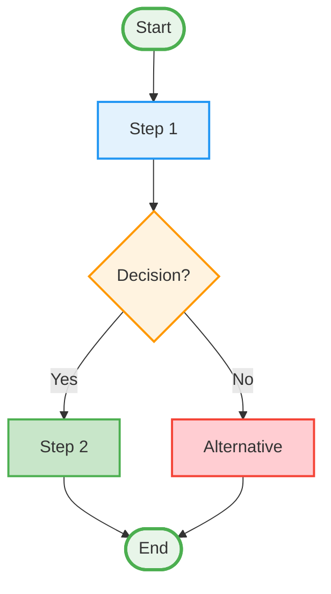
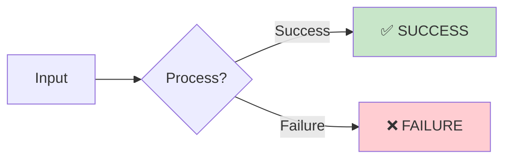
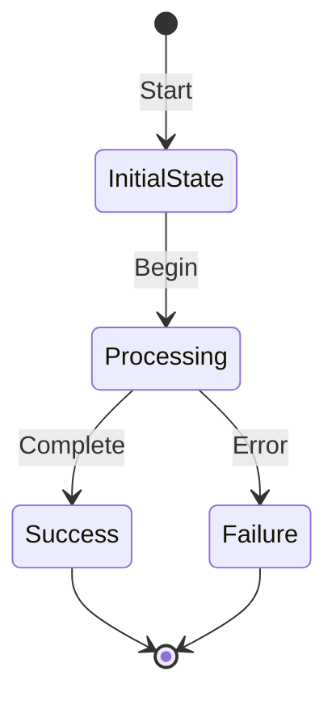
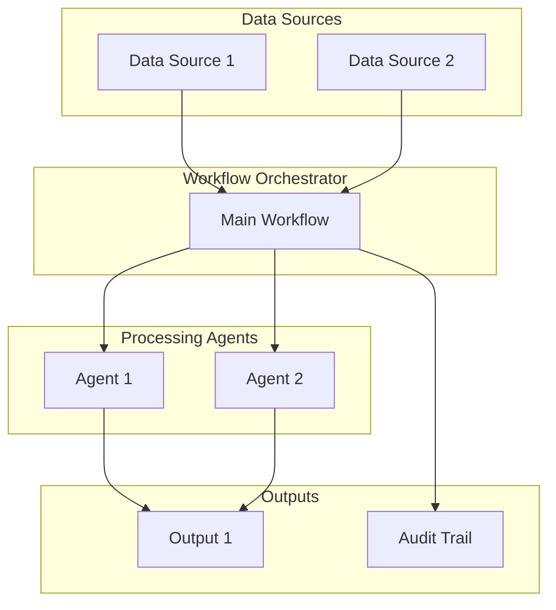
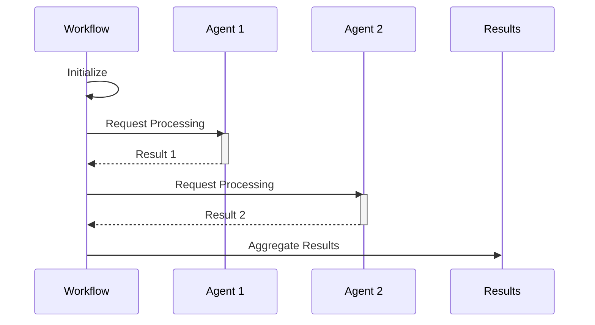
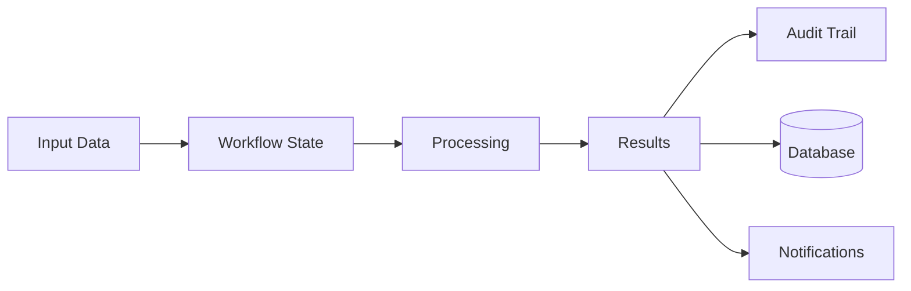
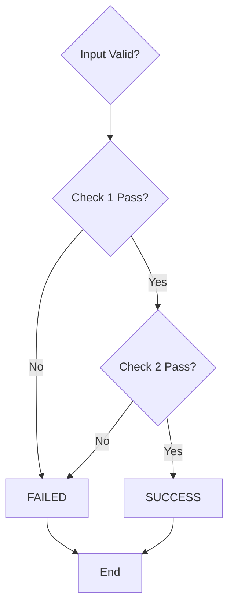

# [Workflow Name] - Visual Diagram

## Complete Workflow Flow



> **Note**: The first Mermaid diagram in this file will be automatically replaced by the corrected diagram from `workflow_registry.py` when displayed on the documentation page.

## Simplified Decision Flow



## State Transitions



## Agent Orchestration



## Process Details



## Execution Timeline

```mermaid
gantt
    title Workflow Execution Timeline
    dateFormat X
    axisFormat %L ms
    
    section Initialization
    Setup: 0, 50
    
    section Processing
    Step 1: 50, 150
    Step 2: 150, 250
    
    section Finalization
    Aggregate: 250, 300
    Audit: 300, 350
```



## Data Flow



## Business Rules Logic



## Key Decision Points

### Decision 1: [Decision Name]
- ✅ Criteria 1?
- ✅ Criteria 2?
- ✅ Criteria 3?

### Decision 2: [Decision Name]
- ✅ Criteria 1?
- ✅ Criteria 2?

### Decision 3: [Decision Name]
- ✅ Criteria 1?
- ⚠️ Warning condition? → Manual review

## Output States

| Status | Meaning | Next Steps |
|--------|---------|------------|
| **SUCCESS** ✅ | Workflow completed successfully | Process complete |
| **PENDING** ⏳ | Awaiting additional action | Manual review needed |
| **REVIEW REQUIRED** ⚠️ | Issue flagged | Admin must investigate |
| **FAILED** ❌ | Workflow failed | Check error details |

## Success Metrics

- **Execution Time**: [Target time]
- **Success Rate**: [Target percentage]
- **Consistency**: [Quality metric]
- **Audit Trail**: Complete documentation

## Use Cases

### Primary Use Case
**Description**: [Main business scenario where this workflow is used]

**Input**: [What data is required]

**Process**: [High-level steps]

**Output**: [What is produced]

### Secondary Use Case
**Description**: [Alternative scenario]

**Input**: [Required data]

**Output**: [Expected results]

## Business Value

### Time Savings
- **Before**: [Manual process time]
- **After**: [Automated time]
- **Savings**: [Percentage or absolute time saved]

### Accuracy Improvement
- **Manual Error Rate**: [Percentage]
- **Automated Error Rate**: [Percentage]
- **Improvement**: [Percentage increase in accuracy]

### Compliance
- **Audit Trail**: Complete logging of all decisions
- **Consistency**: 100% rule application
- **Traceability**: Full documentation chain

## Technical Implementation

### Required Agents
1. **[Agent Name]**: [Purpose and responsibility]
2. **[Agent Name]**: [Purpose and responsibility]

### Data Sources
- **[Source 1]**: [Description]
- **[Source 2]**: [Description]

### External Services
- **[Service 1]**: [API or integration details]
- **[Service 2]**: [API or integration details]

## Error Handling

### Common Errors

| Error Code | Description | Resolution |
|------------|-------------|------------|
| ERR_001 | Invalid input | Verify required fields |
| ERR_002 | Service unavailable | Retry or manual fallback |
| ERR_003 | Data not found | Check data source |

### Retry Logic
- **Automatic Retries**: [Number] attempts
- **Backoff Strategy**: [Exponential/Linear]
- **Fallback**: [Manual process or alternative]

## Configuration

### Required Settings
```json
{
  "setting_1": "value",
  "setting_2": "value",
  "timeout_ms": 30000,
  "retry_count": 3
}
```

### Environment Variables
- `VAR_NAME`: [Description]
- `API_KEY`: [Service API key]

## Testing

### Test Scenarios
1. **Happy Path**: [Expected successful flow]
2. **Edge Case 1**: [Boundary condition]
3. **Error Case**: [Expected failure handling]

### Sample Test Data
```json
{
  "test_input_1": "value",
  "test_input_2": 123,
  "test_flag": true
}
```

## Performance

### Benchmarks
- **Average Execution**: [Time]
- **95th Percentile**: [Time]
- **Maximum Observed**: [Time]

### Optimization Notes
- [Performance consideration 1]
- [Performance consideration 2]

---

## Diagram Legend

- 🟢 Green: Successful/Approved paths
- 🔴 Red: Denied/Failed paths
- 🟡 Yellow: Review required paths
- 🔵 Blue: Pending/Processing paths
- ⬜ Gray: Process steps
- 💎 Diamond: Decision points

---

## Revision History

| Version | Date | Author | Changes |
|---------|------|--------|---------|
| 1.0 | YYYY-MM-DD | [Name] | Initial documentation |

---

Generated for RealtyIQ BeeAI Workflows
